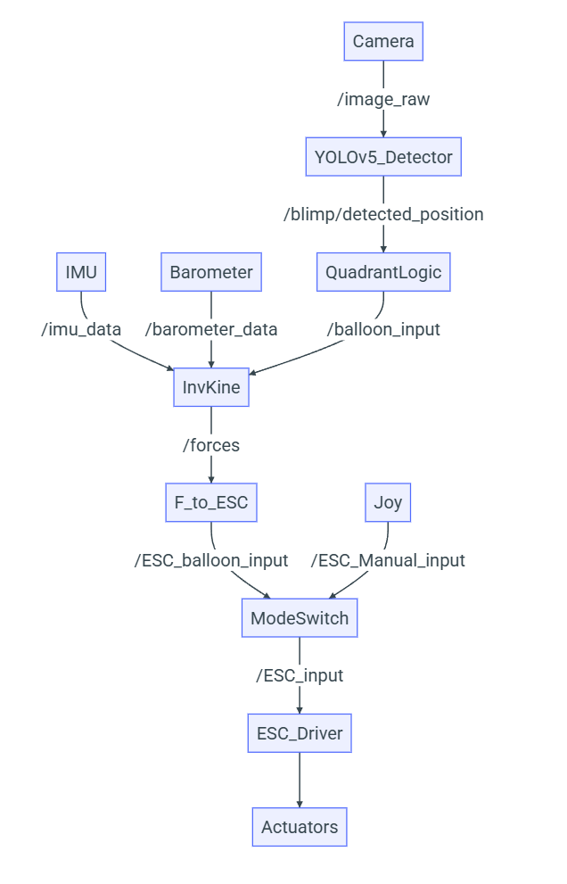
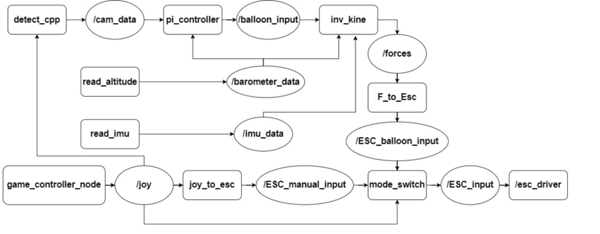
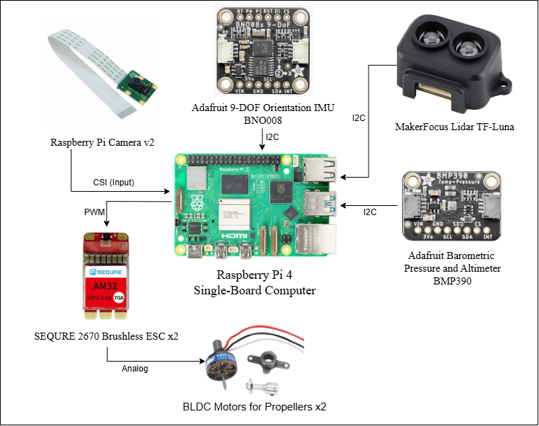
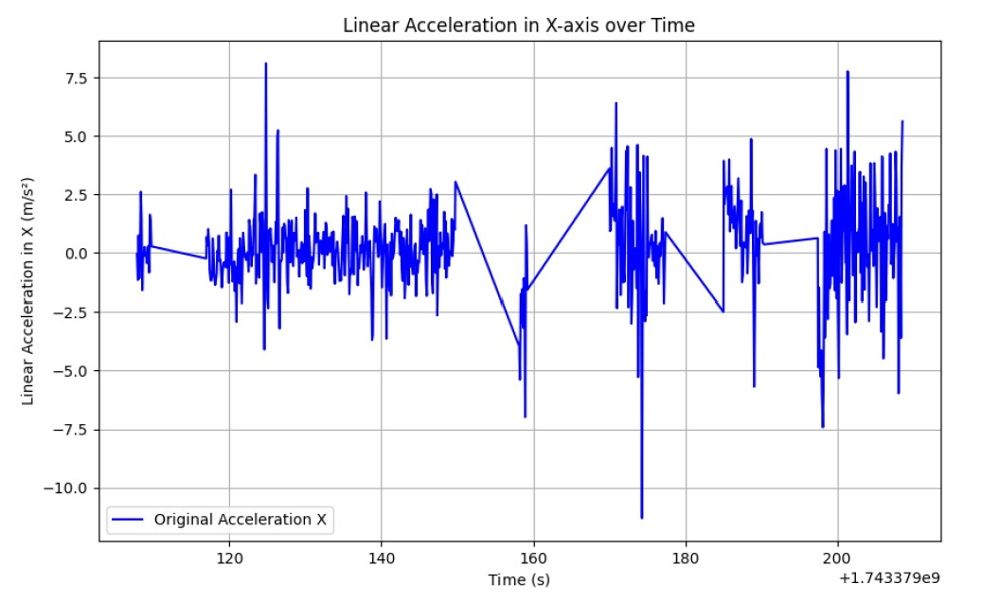
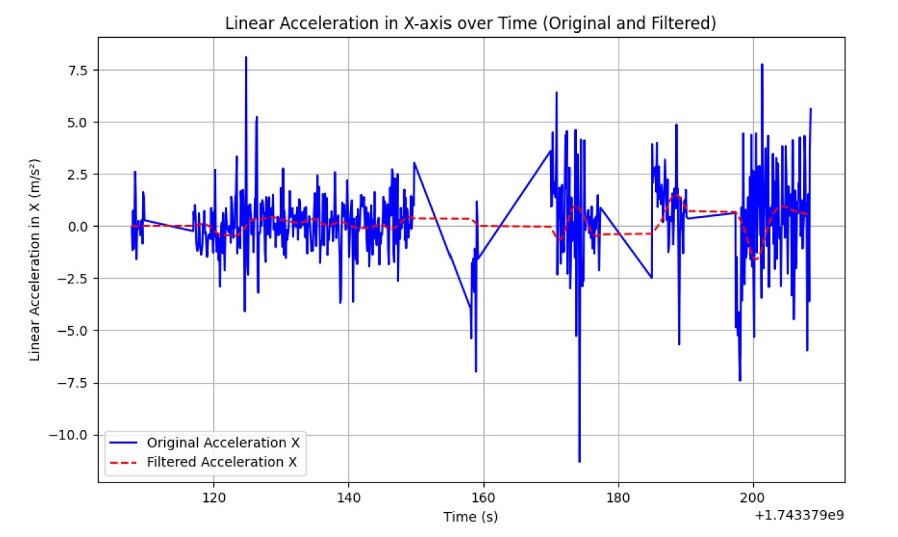

# BLIMP System Design and Data Processing

This document describes the system architecture, data processing pipeline, and filtering techniques used in the BLIMP platform.

---

## 1. System Architecture Overview

The BLIMP system is composed of multiple interconnected components that work together to enable both manual and autonomous flight control. The architecture follows a modular ROS 2-based design with clear data flow between sensors, processing nodes, and actuators.

### 1.1 High-Level System Architecture

The overall system architecture diagram shows the complete data flow:



**Key Components:**
- **Camera Module:** Captures real-time video input for object detection
- **YOLOv5 Detector:** Performs real-time balloon detection from camera feed
- **IMU & Barometer:** Provide motion and altitude data
- **InvKine Module:** Converts desired forces to motor commands (inverse kinematics)
- **Mode Switch:** Selects between manual and autonomous control paths
- **ESC Driver:** Sends PWM signals to motor controllers

### 1.2 Detailed System Workflow

The detailed workflow diagram shows the complete operational pipeline:



**Node Connections:**
- `detect_cpp` → `/cam_data`: Camera detection outputs
- `pi_controller` → `/balloon_input`: Autonomous control decisions
- `read_altitude` → `/barometer_data`: Altitude measurements
- `read_imu` → `/imu_data`: Acceleration and orientation data
- `inv_kine` → `/forces`: Motor force calculations
- `joy_to_esc` / `esc_driver` → Motors: Final motor commands

### 1.3 Hardware Components

The hardware schematic shows all connected components:



**Connected Devices:**
- **Raspberry Pi 4:** Main computing platform
- **Adafruit BNO085 IMU:** 9-DOF orientation and acceleration via I2C
- **BMP390 Barometer:** Altitude and pressure sensing via I2C
- **Pi Camera v2:** Vision input via CSI ribbon cable
- **SEQURE 2670 Brushless ESCs (×2):** Motor speed controllers
- **BLDC Motors (×2):** Propulsion actuators
- **MakerFocus Lidar:** Range finding capability

---

## 2. Data Filtering

Real-time sensor data requires filtering to remove noise and improve stability of the control system. The BLIMP team implemented filtering techniques for the IMU data and demonstrated their effectiveness.

### 2.1 IMU Data Filtering

#### 2.1.1 Raw Data Analysis

The linear acceleration in the X-axis was plotted against time to represent the motion profile during operation:



**Observations from Raw Data:**
- Significant high-frequency noise present throughout the recording
- Acceleration ranges from approximately -10 to +7.5 m/s²
- Prominent spikes and oscillations during various motion phases
- Noise makes direct use in control algorithms problematic

#### 2.1.2 FIR Filtering Approach

The team applied a **Finite Impulse Response (FIR) filter** to smooth the raw IMU data in real-time conditions. FIR filters were chosen because they:
- Are inherently stable
- Support linear phase response (no distortion)
- Can be implemented efficiently on Raspberry Pi
- Have predictable behavior for real-time systems

**FIR Filter Mathematical Definition:**

$$y[n] = \sum_{k=0}^{M} b_k \cdot x[n - k]$$

Where:
- **y[n]** is the output at time index **n**
- **x[n-k]** is the input at time index **n-k** (i.e., the input signal at previous time steps)
- **b_k** are the filter coefficients (the weights applied to each input sample)
- **M** is the filter order, which defines how many previous input values are used

**Why FIR Filtering?**
- Cannot perform forward and backward convolution (would introduce 2× delay, unacceptable for real-time control)
- Simple, one-directional FIR filter provides acceptable smoothing without excessive latency
- Coefficients derive from minimizing frequency domain error between actual and desired responses

#### 2.1.3 Filtered Data Comparison

The original and filtered data are overlaid for direct comparison:



**Filter Effects:**
- **Blue line:** Original noisy acceleration data
- **Red dashed line:** Filtered acceleration data
- High-frequency noise significantly reduced
- Overall motion trends preserved and emphasized
- Smoother input for control loop calculations

**Key Trade-offs:**
- **Window Size vs Responsiveness:** Larger filter order = more smoothing but increased phase lag
- **Time Truncation:** Must handle edge cases at start/end of data where full history unavailable
- **Computational Cost:** Filter order M affects real-time processing overhead

**Implementation Considerations:**
- Filter coefficients pre-computed during system initialization
- Circular buffer maintains last M samples efficiently
- Real-time performance: O(M) complexity per sample

---

## 3. Vision Processing

### 3.1 Camera (Vision Input)

The camera system provides crucial environmental awareness for autonomous operation.

**System Overview:**
- Camera captures raw RGB images at 30 FPS (Raspberry Pi Camera v2, CSI interface)
- YOLOv5 model performs real-time inference to detect balloons
- Detection results include 3D position estimates

**Data Processing Pipeline:**
1. **Image Capture:** Camera → raw image stream
2. **Object Detection:** YOLOv5 model identifies balloons in frame
3. **Localization:** Estimates 3D position (X, Y, Z) relative to camera
4. **Coordinate Transformation:** Converts camera frame to body frame
5. **Control Input:** Position error fed to PI controller

**Key Capabilities:**
- Real-time balloon detection from camera feed
- 3D localization using monocular vision
- Detection coordinates in camera frame: (u, v, depth)
- Transformed to body-frame coordinates for control

**Performance Metrics:**
- Inference speed: ~5-10 FPS on Raspberry Pi 4 (depends on model size)
- Latency: ~100-200ms from image to control command
- Detection accuracy: Optimized for purple/colored balloons

---

## 4. Control Architecture

### 4.1 Electronic Speed Controllers (ESCs)

The ESCs form the interface between the control system and the motors, converting digital PWM signals into motor thrust commands.

#### 4.1.1 ESC Operation

**Signal Type:** Pulse-Width Modulation (PWM)
- **Frequency:** 50 Hz (20ms period)
- **Pulse Width Range:** 1000-2000 microeconds
- **Neutral Position:** 1500 microseconds
- **Linear Mapping:** PWM width directly proportional to motor speed
- **Bus Voltage:** 11.1V nominal (3-cell LiPo battery)

**Motor Configuration (3-Motor System):**
- **Motor 1 (GPIO 5):** Left side motor - Yaw control
- **Motor 2 (GPIO 6):** Right side motor - Yaw control  
- **Motor 3 (GPIO 13):** Bottom motor - Vertical thrust (altitude)
- **Motor 4 (GPIO 26):** Reserved for future expansion

#### 4.1.2 PID-Based Control

The system uses PID (Proportional-Integral-Derivative) controllers to generate appropriate PWM signals:

**PID Parameters:**
- **Kp (Proportional Gain):** Responds to current error
- **Ki (Integral Gain):** Compensates for steady-state error
- **Kd (Derivative Gain):** Dampens oscillations and overshooting

**Process:**
1. **Error Calculation:** Desired position - Actual position
2. **Gain Application:** PWM = Kp×error + Ki×∫error + Kd×d(error)/dt
3. **Signal Generation:** Convert PID output to PWM pulse width
4. **Motor Actuation:** ESC receives PWM → motor spins proportionally

#### 4.1.3 Control Modes

**Manual Mode:**
- Xbox controller input → PWM commands
- Direct user control of motor speeds
- Real-time responsiveness critical

**Autonomous Mode:**
- Camera detection + PI controller
- Closed-loop feedback from IMU and barometer
- System maintains altitude and tracks balloon position

**Mode Switching:**
- RB button toggles between modes every 500ms
- Safe transition: motors hold steady during switch
- Visual feedback via LED indicators

---

## 5. Data Flow Summary

### Manual Control Path
```
Xbox Controller
    ↓
joy_to_esc_input.py (axis mapping)
    ↓
Mode Switcher (manual path)
    ↓
ESC Input PWM values
    ↓
ESC Driver (GPIO outputs)
    ↓
Motors
```

### Autonomous Control Path
```
Camera → YOLOv5 Detection
    ↓
Balloon Position (/cam_data)
    ↓
PI Controller → Desired Forces
    ↓
Inverse Kinematics (/forces)
    ↓
Motor PWM Allocation (/ESC_balloon_input)
    ↓
Mode Switcher (autonomous path)
    ↓
ESC Driver
    ↓
Motors
```

**Sensor Inputs to Autonomous Controller:**
- Camera detection coordinates (X, Y from center)
- IMU acceleration (for stability and vibration detection)
- Barometer altitude (for vertical control)

---

## 6. System Integration Points

### 6.1 Real-Time Constraints

- **Control Loop Rate:** 50 Hz (20ms period)
- **IMU Sampling:** 100+ Hz (downsampled to 50 Hz for control)
- **Camera Processing:** ~5-10 FPS (does not gate control loop)
- **ESC Update Rate:** 50 Hz (synchronized with control loop)

### 6.2 Latency Budget

| Component | Latency |
|-----------|---------|
| Sensor acquisition | 5-10ms |
| Data filtering | 1-2ms |
| Computer processing | 5-10ms |
| PWM generation | <1ms |
| **Total** | **~15-20ms** |

### 6.3 Failure Modes

**Sensor Failures:**
- Loss of camera input → fallback to barometer-only altitude control
- IMU disconnection → alert user, limit control authority
- Barometer failure → maintain last known altitude estimate

**Communication Failures:**
- ROS topic timeout → safety shutdown (motors to neutral)
- ESC driver crash → pigpio daemon restarts services

---

## References and Additional Resources

- [ROS 2 Documentation](https://docs.ros.org/en/humble/)
- YOLOv5 Model: Used for real-time object detection
- BNO085 IMU Datasheet: 9-DOF orientation sensor
- BMP390 Barometer Datasheet: Altitude and pressure measurements
- SEQURE 2670 ESC: Brushless motor controller specifications
